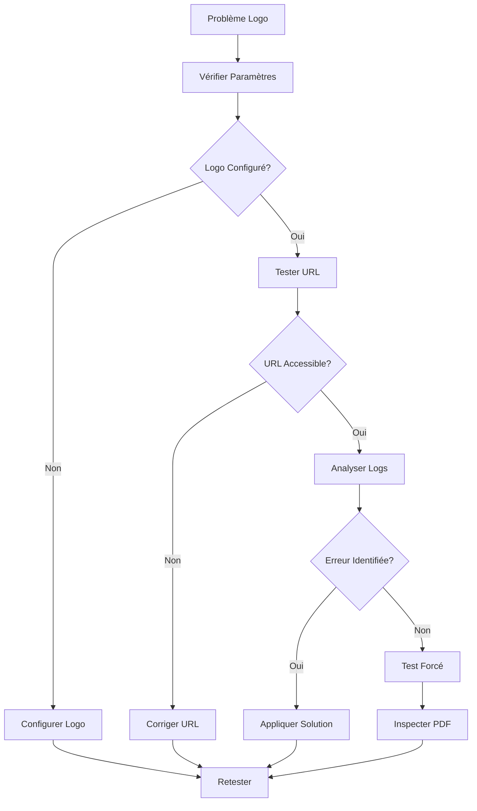

# 🔍 Guide de Débogage - Logo Bon de Livraison

## 🎯 Problème

Le logo configuré dans les paramètres de l'entreprise n'apparaît pas dans le bon de livraison généré.

## 🧠 Analyse des Causes Possibles

### **1. Problème de Mapping des Champs**
- ❌ **CAUSE IDENTIFIÉE** : Incohérence entre `companyLogo` (DB) et `logo` (code)
- ✅ **CORRIGÉ** : Mapping correct dans `delivery-note-generator.ts`

### **2. Problème de Récupération des Paramètres**
- API `/api/settings/company` ne retourne pas le logo
- Session/authentification incorrecte
- Erreur dans `getCompanySettings()`

### **3. Problème de Chargement d'Image**
- URL du logo incorrecte ou inaccessible
- Problème CORS
- Format d'image non supporté
- Erreur dans `loadImageAsBase64()`

### **4. Problème dans le Générateur PDF**
- Erreur dans `addCompanyLogo()`
- Problème d'async/await
- Erreur silencieuse dans jsPDF

## 🔧 Corrections Apportées

### **1. Mapping des Champs Corrigé**

```typescript
// ❌ AVANT (incorrect)
logo: settings.logo || undefined

// ✅ APRÈS (correct)
logo: settings.companyLogo || undefined
```

### **2. Logs de Débogage Ajoutés**

```typescript
console.log('📋 Paramètres récupérés:', {
  name: settings.companyName,
  logo: settings.companyLogo,
  address: settings.companyAddress
})

console.log('🖼️ Tentative d\'ajout du logo:', {
  hasLogo: !!company.logo,
  logoUrl: company.logo,
  position: { x, y },
  size
})
```

### **3. Fonction de Chargement Améliorée**

```typescript
async function loadImageAsBase64(url: string): Promise<string | null> {
  try {
    console.log('🌐 Tentative de fetch de l\'image:', url)
    const response = await fetch(url)
    
    console.log('📡 Réponse fetch:', {
      status: response.status,
      statusText: response.statusText,
      ok: response.ok,
      contentType: response.headers.get('content-type')
    })
    
    // ... reste du code avec logs détaillés
  } catch (error) {
    console.error('❌ Erreur lors du chargement:', error)
    return null
  }
}
```

## 🧪 Outils de Débogage

### **1. Script de Diagnostic Complet**
```bash
# Dans la console du navigateur
# Copier le contenu de scripts/debug-delivery-note-logo.js
runFullDiagnostic()
```

### **2. Script de Test Forcé**
```bash
# Dans la console du navigateur  
# Copier le contenu de scripts/test-logo-force.js
testWithForcedLogo()
```

### **3. Test Manuel des Paramètres**
```bash
# Test API
fetch('/api/settings/company').then(r => r.json()).then(console.log)

# Test chargement image
testImageLoading('URL_DU_LOGO')
```

## 📋 Procédure de Débogage

### **Étape 1 : Vérifier les Paramètres**

1. **Allez sur** `/dashboard/settings`
2. **Vérifiez** que le logo est bien configuré
3. **Testez l'API** :
   ```javascript
   fetch('/api/settings/company').then(r => r.json()).then(console.log)
   ```

### **Étape 2 : Tester l'Accessibilité du Logo**

1. **Copiez l'URL** du logo depuis les paramètres
2. **Testez dans le navigateur** : Ouvrez l'URL directement
3. **Testez programmatiquement** :
   ```javascript
   fetch('URL_DU_LOGO').then(r => console.log(r.status, r.ok))
   ```

### **Étape 3 : Analyser la Génération**

1. **Ouvrez la console** du navigateur (F12)
2. **Exécutez le script** de diagnostic
3. **Générez un bon de livraison**
4. **Observez les logs** détaillés

### **Étape 4 : Test avec Logo Forcé**

1. **Exécutez** `testWithForcedLogo()`
2. **Générez un bon de livraison** quand demandé
3. **Inspectez le PDF** téléchargé automatiquement

## 🔍 Messages de Log à Surveiller

### **Logs Normaux (Succès)**
```
📄 Début génération PDF bon de livraison
📋 Paramètres récupérés: { name: "...", logo: "..." }
🏢 Informations entreprise mappées: { name: "...", logo: "..." }
🖼️ Tentative d'ajout du logo: { hasLogo: true, logoUrl: "..." }
📥 Chargement du logo depuis: ...
🌐 Tentative de fetch de l'image: ...
📡 Réponse fetch: { status: 200, ok: true }
📦 Blob créé: { size: ..., type: "image/..." }
✅ Image convertie en base64, taille: ... caractères
✅ Logo ajouté au PDF avec succès
```

### **Logs d'Erreur (Problèmes)**
```
❌ Aucun logo configuré, utilisation du fallback
❌ Réponse fetch non OK: 404 Not Found
❌ Erreur lors du chargement de l'image: ...
❌ Erreur lors de l'ajout du logo au PDF: ...
```

## 🛠️ Solutions par Type d'Erreur

### **Erreur 1 : "Aucun logo configuré"**
```
🔧 SOLUTION:
1. Allez sur /dashboard/settings
2. Ajoutez un logo dans "Informations de l'entreprise"
3. Sauvegardez les modifications
```

### **Erreur 2 : "Réponse fetch non OK: 404"**
```
🔧 SOLUTION:
1. Vérifiez que l'URL du logo est correcte
2. Testez l'URL dans le navigateur
3. Assurez-vous que le fichier existe
```

### **Erreur 3 : "Erreur CORS"**
```
🔧 SOLUTION:
1. Utilisez une URL du même domaine
2. Ou uploadez le logo sur votre serveur
3. Ou utilisez un logo en base64
```

### **Erreur 4 : "Format non supporté"**
```
🔧 SOLUTION:
1. Utilisez PNG ou JPEG
2. Évitez SVG ou formats exotiques
3. Vérifiez la taille (< 1MB recommandé)
```

## 🧪 Tests de Validation

### **Test 1 : Logo URL Externe**
```javascript
testWithSpecificLogo('https://via.placeholder.com/200x200/2563EB/FFFFFF?text=LOGO')
```

### **Test 2 : Logo Base64**
```javascript
testWithBase64Logo()
```

### **Test 3 : Logo Local**
```javascript
// Uploadez un logo via l'interface puis testez
testCompanySettingsAPI()
```

## 📊 Métriques de Succès

### **Indicateurs Positifs**
- ✅ API retourne `companyLogo` non null
- ✅ Fetch du logo retourne status 200
- ✅ Blob créé avec taille > 0
- ✅ Base64 généré avec longueur > 1000
- ✅ `addImage()` exécuté sans erreur

### **Indicateurs Négatifs**
- ❌ `companyLogo` null ou undefined
- ❌ Fetch retourne 404/403/500
- ❌ Blob vide ou type incorrect
- ❌ Erreur dans FileReader
- ❌ Exception dans jsPDF

## 🔄 Workflow de Résolution



## ✅ Checklist de Vérification

- [ ] Logo configuré dans `/dashboard/settings`
- [ ] URL du logo accessible dans le navigateur
- [ ] API `/api/settings/company` retourne le logo
- [ ] Logs de génération sans erreur
- [ ] Test avec logo forcé réussi
- [ ] PDF généré contient le logo

---

**Version** : 2.0.0  
**Date** : 2025-01-09  
**Auteur** : Équipe Alami Gestion
